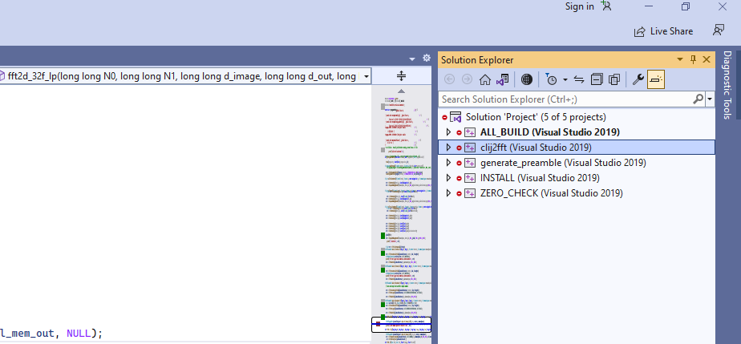

## Debugging with Visual Studio

### Get a bash prompt with Visual Studio variables set

We do this so we can run bash scripts with cmake and it will find the visual studio compiler and environment variables.  Instructions below are for VS 2019, but should be similar for other versions. 

1.  From Start menu run 'x64 Native Tools Command Prompt for VS 2019'
2.  From the Command Prompt start a bash shell “C:\Program Files\Git\bin\sh.exe”  

### Use cmake to create visual studio solution and project files  

1.  Run the script [cmakevs.sh]() by typing ```bash cmakevs.sh```, it should create the visual studio files (set for debug build) in a directory called Visual_Studio.

### Open Visual Studio and compile 

On the left hand pane run 'All Build' and 'INSTALL'

  

### Open up the clij-fft project in IDE and start ImageJ

(This step is only needed is you want to step through both java and c++ code.   Alternatively you could simply start a copy of Fiji with a debug version of clij2-fft installed.)

You need to start ImageJ with a test Java program similar to [this one](https://github.com/clij/clij2-fft/blob/master/src/test/java/net/haesleinhuepf/clijx/tests/LaunchIJ.java).

Then you need to put the functionality you want to test in a [Command](https://github.com/clij/clij2-fft/blob/master/src/main/java/net/haesleinhuepf/clijx/plugins/FFTFilterCommand.java).

Note.  When testing just the java code we often just run everything in a single test class.  However we need to attach the c++ debugger to a running process, so we first start an Instance of ImageJ, then attach, then run the code we want to test as a command. 

### Attach Visual Studio debugger to ImageJ

In Visual Studio go to ```Debug>Attach to Process```.  In the process list look for either ```ImageJ``` or ```javaw``` (if yhou started ImageJ from a java IDE). 
